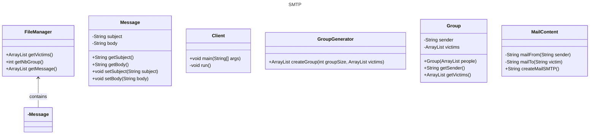

## But du programme

## instructions du fonctionnement (comment le lancer)
In order to make this project work you need to use a server called maildev. To be able to use it you 
first need to have docker installed on your computer. Then you need to run the following command in the terminal:
`docker pull maildev/maildev` if you don't have the image already. Then you need to run the following command to start the server:
`docker run -p 1080:1080 -p 1025:1025 maildev/maildev`. Finally, you can start a new page in your favorite browser and 
go to the following address: `http://localhost:1080/` to see the mails that have been sent.

## To-do

- [x] refaire createGroups
- [x] Arguments ligne de commande pour nombre de groupe 
- [x] Solve paths....
- [x] classe group
- [x] rename mailGroup into groupGenerator
- [x] There must be at least a simple validation process of the input files that displays errors on the console to describe what's wrong (e.g. an invalid number of groups, an invalid e-mail address that does not contain a '@' character, an invalid format, etc.).
- [x] Check: nb group, address format, messages format (body and messages), fichiers vides
- [x] Erreur si sujet ou corps vide a cause des regex et si y a pas de mail. -> Exception
- [x] Check erreur du serveur -> les gerer
- [x] Mettre un nombre de groupe par défaut si aucun provided par user (ABANDONED)
- [x] Checker si les fichiers de config sont bien la
- [ ] Readme
- [ ] javadoc
- [x] Check at least two adresses
- [ ] Change temp in getMessage?
- [x] ...

## Diagramme de classe

