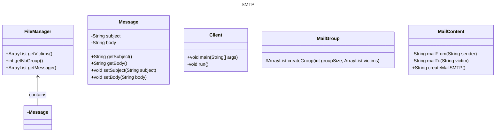

## But du programme

## instructions du fonctionnement (comment le lancer)
In order to make this project work you need to use a server called maildev. To be able to use it you 
first need to have docker installed on your computer. Then you need to run the following command in the terminal:
`docker pull maildev/maildev` if you don't have the image already. Then you need to run the following command to start the server:
`docker run -p 1080:1080 -p 1025:1025 maildev/maildev`. Finally, you can start a new page in your favorite browser and 
go to the following address: `http://localhost:1080/` to see the mails that have been sent.

## Diagramme de classe

