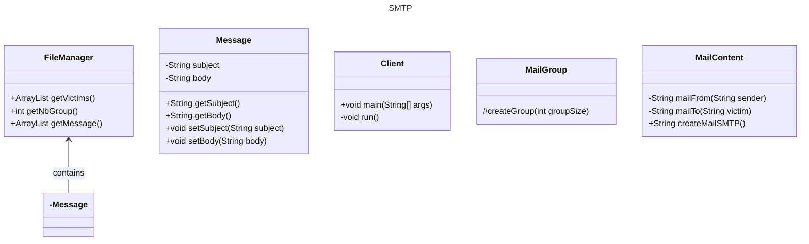

## But du programme

## instructions du fonctionnement (comment le lancer)

## Diagramme de classe

```mermaid
---
title: SMTP
---
classDiagram
    
    class FileManager {
        +ArrayList<String> getVictims()
        +int getNbGroup()
        +ArrayList<String> getMessage()
    }
    
    class Message {
        -String subject
        -String body
        +String getSubject()
        +String getBody()
        +void setSubject(String subject)
        +void setBody(String body)
    }
    
    class Client {
        +void main(String[] args)
        -void run()
    }
    
    class MailGroup {
        #createGroup(int groupSize)
    }
    
    class MailContent {
        -String mailFrom(String sender)
        -String mailTo(String victim)
        +String createMailSMTP()
    }

    FileManager <--- Message : contains

```