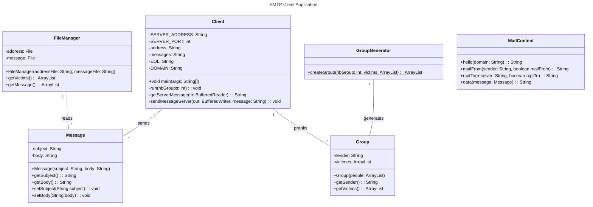
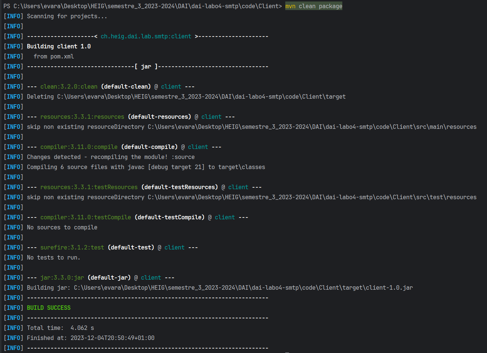

## To-do

- [x] refaire createGroups
- [x] Arguments ligne de commande pour nombre de groupe
- [x] Solve paths....
- [x] classe group
- [x] rename mailGroup into groupGenerator
- [x] There must be at least a simple validation process of the input files that displays errors on the console to describe what's wrong (e.g. an invalid number of groups, an invalid e-mail address that does not contain a '@' character, an invalid format, etc.).
- [x] Check: nb group, address format, messages format (body and messages), fichiers vides
- [x] Erreur si sujet ou corps vide a cause des regex et si y a pas de mail. -> Exception
- [x] Check erreur du serveur -> les gerer
- [x] Mettre un nombre de groupe par défaut si aucun provided par user (ABANDONED)
- [x] Checker si les fichiers de config sont bien la
- [ ] Readme
- [ ] javadoc
- [x] Check at least two adresses
- [ ] Change temp in getMessage?
- [x] ...
# README

## Project description

This repository contains a TCP client application in Java, designed to interact with SMTP servers. 
This client application uses the socket API to communicate with the server and includes a partial implementation of the 
Simple Mail Transfer Protocol (SMTP). The main goal of the application is to allow the user to send forged emails to 
a list of victims using a mock SMTP server. The user can specify the number of victim groups to create, the list of 
victims and the messages that will be sent to the victims. The application will then send a random message from the 
list to a group of victims using the SMTP server.

## Instructions for setting up the mock SMTP server

In order to make this project work, you need to use a mock SMTP server called ```maildev```. To do so, you 
first need to have ```docker``` installed on your computer. To download the docker image of ```maildev```, you need to 
run the following command in your terminal:

```shell
docker pull maildev/maildev
```

Once you have the docker image downloaded, you need to run the following command to start the server:

```shell
docker run -p 1080:1080 -p 1025:1025 maildev/maildev
``` 

The SMTP server is now accessible on port 1025 and usable. You can now open a new page in your favorite browser and go to the 
following address: `http://localhost:1080/` to see the emails that have been sent to the server.

## Instructions for running a prank campaign

### Configuration files

In order to run a prank campaign, you have to provide the application with some configuration files. These files
must be stocked in the ```config``` folder at the root of the project. The application will look for the files in this 
folder. If the files are not found, the application will throw an exception and stop. It is important to note that the
application uses a ```UTF-8``` encoding. The files needed are the following:

#### address configuration file

This file contains the list of victims that will be used to create the victim groups. There must be only one address per line
and the address must be in the following format: ```<local-part>@<domain>```. The address file must contain at least 2
addresses to be valid. An example address configuration file is provided.

#### message configuration file

This file contains the list of messages that will be sent to the victims. In this file, the Json format is used to
represent the data. The message begins with the header ```message```, the subject of the email is delimited by the 
header ```subject``` and the content of the message by the header ```body```. You can see an example of the expected
format below:

```json
[
  {
    "message": {
      "subject": "<subject content>",
      "body": "<body content>"
    }
  }
]
```

The different messages are separated by a comma. You can see an example message configuration file in the ```config```.

### Run the application

The project is built using Maven, that you will have to install on your computer beforehand.
To run the application, you need to run the following commands in the root of the project, where the ```pom.xml``` file is located.

```shell
mvn clean package
cd ..\..
java -jar .\target\client-1.0.jar <number of groups>
```

The first command will build the project and the second one will run the application. The number of groups is an 
argument that allows you to specify the number of victim groups that will be created. If you don't provide this argument, the
application won't run. The number of groups must be greater than 0.

Once you run the application, the prank messages will be sent to the victims using the mock SMTP server.

## Implementation

### Class diagram




### Class description

- ```Client```: This class is the main class of the application. It is used to create a connection with the mock SMTP server and
launching the prank campaign.
- ```FileManager```: This class is responsible for reading the configuration files and returning the data to the 
application.
- ```Message```: This class represents a message that will be sent to the victims. A message is represented by a subject 
and a body.
- ```MailContent```: This class is responsible for creating the SMTP messages that the client will send to the server.
- ```Group```: This class represents a group of victims. A group is represented by a sender and a list of victims.
- ```GroupGenerator```: This class is responsible for creating the groups of victims for the prank campaign.

## Prank campaign example step-by-step

Having already downloaded the docker image of the mock SMTP server, I can run the server.


After that, I build the application using Maven.



I run it and I asks to create 5 victim groups.


I open my browser and go to the address ```http://localhost:1080/``` to see the emails that have been sent to the server.

